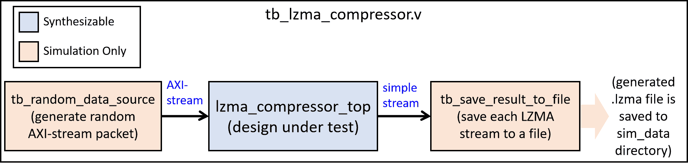

-9A90FD.svg)   

[English](#en) | [中文](#cn)

　

<span id="en">FPGA LZMA compressor</span>
===========================

An FPGA-based LZMA compressor. For generic lossless data compression.

> :cloud: [LZMA](https://www.7-zip.org/sdk.html) is a popular data compression algorithm, which is defaultly use by ".7z" and ".xz" format. It is also available in ".zip" format.
>
> :+1: [LZMA](https://www.7-zip.org/sdk.html) usually has better compression ratio than DEFLATE and BZIP algorithm.

　


　

Features:

* **Pure RTL design** which is universal for all FPGA platforms.
* **Simple streaming input/output** : input raw data stream, output compressed LZMA stream.
* LZMA dictionary size: 131072 bytes
* The hash search engine support 4096 hash values, each value has 8 hash entries.
* **High compression ratio** (see following table for detail)
* **FPGA resource** :
  * use **2166 LUTs** and **109 BRAM18K** on Xilinx 7 series
  * use **3282 LUTs** and **1.8 Mbits** BRAM on Altera Cyclone IV.

* **Performance**：
  * **133 MHz** on the slowest speed-level device of Xilinx Artix7 (e.g. XC7A100TCSG324-1)
  * **260 MHz** on the slowest speed-level device of Xilinx Zynq Ultrascale+ (e.g. xczu3eg-sbva484-1-e)
  * **85 MHz** on the slowest speed-level device of Altera Cyclone IV E (e.g. EP4CE115F23C8)
  * **17 cycles to consume a input byte** on average.

For current version, the compression ratio and FPGA resource are good enough, but the performance doesn't satisfy me (only similar to single-threaded compression on personal computers). Therefore, the current version may only be usefual for some embedded applications. I will optimize its performance in the future.

　

We use a [512KB data](https://github.com/WangXuan95/FPGA-Gzip-compressor/blob/main/Arty-example/python/raw.hex) as input to compare several compressors, the result is as follows:

|                          Compressor                          |          Compress algorithm           | Compress level | Compressed size |
| :----------------------------------------------------------: | :-----------------------------------: | :------------: | :-------------: |
|                       do not compress                        |                   -                   |       -        |     512 KB      |
|           [7ZIP software](https://www.7-zip.org/)            | GZIP, ".gz" format, DEFLATE algorithm |      fast      |     287 KB      |
|           [7ZIP software](https://www.7-zip.org/)            | GZIP, ".gz" format, DEFLATE algorithm |    standard    |     281 KB      |
|           [7ZIP software](https://www.7-zip.org/)            | GZIP, ".gz" format, DEFLATE algorithm |    extreme     |     260 KB      |
|           [7ZIP software](https://www.7-zip.org/)            |   XZ, ".xz" format, LZMA2 algorithm   |      fast      |     262 KB      |
|           [7ZIP software](https://www.7-zip.org/)            |   XZ, ".xz" format, LZMA2 algorithm   |    standard    |     249 KB      |
|           [7ZIP software](https://www.7-zip.org/)            |   XZ, ".xz" format, LZMA2 algorithm   |    extreme     |     248 KB      |
| [FPGA-GZIP-compressor](https://github.com/WangXuan95/FPGA-Gzip-compressor) | GZIP, ".gz" format, DEFLATE algorithm |       -        |     299 KB      |
|               **FPGA-LZMA-compressor (this)**                |    ".lzma format", LZMA algorithm     |       -        |   **255 KB**    |

　

　

# Module Usage

The design source code is in [**RTL**](./RTL) directory. In which [**lzma_compressor_top.v**](./RTL/lzma_compressor_top.v) is the top module.

## Module in/out signals

The in/out signals of *lzma_compressor_top* is as follows:

```verilog
module lzma_compressor_top (
    input  wire        rstn,
    input  wire        clk,
    // input : raw data stream
    output wire        i_ready,
    input  wire        i_valid,
    input  wire        i_last,
    input  wire [ 7:0] i_data,
    // output : LZMA stream  // Note! need to add an additional 13-byte fixed header before the output stream to make up a complete "LZMA" file format. The 13 bytes are : {0x5E, 0x00, 0x00, 0x02, 0x00, 0xFF, 0xFF, 0xFF, 0xFF, 0xFF, 0xFF, 0xFF, 0xFF}
    output wire        o_valid,
    output wire [ 7:0] o_data,
    output wire        o_end    // end of a LZMA stream
);
```

　

## Reset

- reset when `rstn=0`
- On most FPGAs, it can actually work without resetting. On some FPGAs that do not support `initial` register, it is necessary to reset before use.

　

## Input stream

The input interface is a standard 8-bit wide AXI-stream slave. We use it to input the data to be compressed.

- `i_valid` handshakes with `i_ready` . Successfully input 1 data only when `i_valid=1` and `i_ready=1` simultaneously (see following figure).
- `i_data` is one-byte input data.
- `i_last` is the boundary mark of the package, ` i_last=1 ` means that the current byte is the last byte of a packet, and the next transmitted byte is the first byte of the next packet. Each packet is compressed into an independent LZMA stream.

```
             _    __    __    __    __    __    __    __    __    __    __    __
    clk       \__/  \__/  \__/  \__/  \__/  \__/  \__/  \__/  \__/  \__/  \__/  \
                         _____________________________             _____
    valid    ___________/                             \___________/     \________
             _________________                   ________________________________
    ready                     \_________________/
                         _____ _______________________             _____
    data     XXXXXXXXXXXX__D1_X___________D2__________XXXXXXXXXXXXX__D3_XXXXXXXXX  
```

　

## Output LZMA stream

The output interface is a simple stream without handshake.

- `o_valid=1` means there's a valid output byte on `o_data`
- `o_data` is the data byte of compressed LZMA stream.
- `o_end` is to indicate the boundary of LZMA stream. When an LZMA stream ends, `o_end=1`  for one cycle. In other case, `o_end=0` 
- `o_valid` and `o_end` cannot be both 1 at the same time

　

## Add header for output LZMA stream

Each output stream is a independent LZMA stream, without any headers.

To let the output LZMA stream be recognized, we need to use "container formats" (i.e., add headers). Note that ".zip", ".xz", ".7z" are all container formats. (Here we do not introduce them).

**A simpest way is to use the ".lzma" container format**. Its format is simple:

```
".lzma" format = 13-byte header + LZMA stream
```

The 13-byte header is:

```
0x5E, 0x00, 0x00, 0x02, 0x00, 0xFF, 0xFF, 0xFF, 0xFF, 0xFF, 0xFF, 0xFF, 0xFF
```

After this 13-byte header, we append the LZMA stream, i.e., the bytes outputted by my module.

We put all these bytes to a ".lzma" file, then the file can be recognized and decompressed by several LZMA softwares (see [How to decompress the generated ".lzma" file](#dec_en) for detail)

　

　

# Simulation

The simulation source code is in [SIM](./SIM) directory. In which [**tb_lzma_compressor.v**](./SIM/tb_lzma_compressor.v) is the top module.

The diagram of this testbench is as follows:



　

Among them, the random data packet generator (tb_random_data_source.v) will generate four types of data packets with different characteristics (random bytes with uniform distribution, random bytes with non-uniform distribution, randomly continuously changing data, and sparse data), which will be sent to the design under test (lzma_compressor_top) for compression.

tb_save_result_to_file.v module will store the compressed results into files. Each stream is stored into a independent .lzma file (it will append the 13-byte header).

　

## Simulate using iverilog

You can follow the following steps to simulate using iverilog:

* Install iverilog, see [iverilog_usage](https://github.com/WangXuan95/WangXuan95/blob/main/iverilog_usage/iverilog_usage.md) 
* In Windows, double click tb_lzma_compressor_run_iverilog.bat to run simulation. Where tb_lzma_compressor_run_iverilog.bat contains the simulation compilation and running commands.
* When simulation, the random packet generator will generate 10 packets by default, the simulation usually takes about ten minutes to complete. You can modify the macro `FILE_COUNT` in tb_random_data_source.v.  
* **The generated compressed LZMA data will be stored in sim_data directory as ".lzma" file.**

　

## Simulate using other simulators

In addition to iverilog, you can use other simulators. Just add all the .v files in RTL and SIM directories to the simulation project, and set tb_lzma_compressor.v to be the top-level file for simulation.

　

## <span id="dec_en">How to decompress the generated ".lzma" file</span>

The data of the ".lzma" file is composed of a 13-byte header and LZMA compressed stream. Here is how to use software to decompress ".lzma" file.

### on Windows

On Windows, you can use the [official LZMA software](./https://www.7-zip.org/sdk.html) to decompress the generated ".lzma" file. To get it, download the "LZMA SDK", extract it. in the "bin" directory, you can see "lzma.exe".

I've put the executable file "lzma.exe" into [SIM](./SIM) directory.

To decompress a ".lzma" file, run command as:

```powershell
.\lzma.exe d [input_lzma_file] [output_file]
```

For example, the following command can decompress "sim_data\out001.hex.lzma" to "out001.hex":

```powershell
.\lzma.exe d sim_data\out001.hex.lzma out001.hex
```

### on Linux

On Linux, you can decompress ".lzma" file using the official "XZ-Utils" on Linux. You should firstly install it:

```bash
apt-get install xz-utils
```

Then use following command to decompress the ".lzma" file.

```bash
lzma -dk [input_lzma_file]
```

For example, the following command can decompress "sim_data/out001.hex.lzma". The decompressed file will be "sim_data/out001.hex"

```bash
lzma -dk sim_data/out001.hex.lzma
```

　

　

# See Also

The official code and document of LZMA & 7ZIP:

- [1]  https://www.7-zip.org/sdk.html

To quickly understand the algorithm of LZMA, see:

- [2]  wikipedia : https://en.wikipedia.org/wiki/Lempel%E2%80%93Ziv%E2%80%93Markov_chain_algorithm
- [3]  A minimal LZMA data compressor & decompressor. Only hundreds of lines of C : https://github.com/WangXuan95/TinyLZMA

Other FPGA-based data compressors (based on GZIP/DEFLATE algorithm, the compression ratio is not better than LZMA):

- [4]  FPGA-Gzip-compressor : https://github.com/WangXuan95/FPGA-Gzip-compressor
- [5]  HDL-deflate : https://github.com/tomtor/HDL-deflate

　

　

　

　

　

　

<span id="cn">FPGA LZMA compressor</span>
===========================

一个基于 FPGA 的 LZMA 压缩器，用于通用数据压缩

> :cloud: [LZMA](https://www.7-zip.org/sdk.html) 是一种常用的数据压缩算法。".7z" 和 ".xz" 格式默认使用的算法是 LZMA。".zip" 格式也支持 LZMA 算法。
>
> :+1: [LZMA](https://www.7-zip.org/sdk.html) 的压缩率通常高于 GZIP/DEFLATE 和 BZIP

　


　

特点

*  **纯 RTL 设计**，适用于各种 FPGA 平台。
*  **极简的流式输入/输出接口** ，输入待压缩数据，输出LZMA压缩流。
* LZMA 字典大小: 131072 字节
* 哈希匹配搜索引擎。支持 4096 个哈希值，每个哈希值对应 8 个 entry
* **高压缩率** (详见下表)
* **FPGA 资源占用** :
  * 在 Xilinx 7 系列上占 **2166 LUTs** 和 **109 BRAM18K** 
  * 在 Altera Cyclone IV 系列上占 **3282 LUTs** and **1.8 Mbits** BRAM

* **性能**：
  * 在 Xilinx Artix7 的速度最慢的FPGA (-1 速率级别) 上达到 **133 MHz**
  * 在 Xilinx Zynq Ultrascale+ 的速度最慢的FPGA (-1 速率级别) 上达到 **260 MHz**
  * 在 Altera Cyclone IV E 的速度最慢的FPGA (8 速率级别) 上达到 **85 MHz**
  * 输入一个字节需要 17 周期 (平均)

当前版本的压缩率和FPGA资源消耗都足够好，但性能还不够让我满意 (其性能仅类似于个人计算机上的单线程压缩)。因此，当前版本可能仅适用于某些嵌入式应用。我将来会优化它的性能。

　

我使用一个 [512KB data](https://github.com/WangXuan95/FPGA-Gzip-compressor/blob/main/Arty-example/python/raw.hex) 作为待压缩数据，比较该压缩器与其它压缩方案。见下标。

|                            压缩器                            |            压缩算法            | 压缩级别 | 压缩后大小 |
| :----------------------------------------------------------: | :----------------------------: | :------: | :--------: |
|                       do not compress                        |               -                |    -     |   512 KB   |
|             [7ZIP 软件](https://www.7-zip.org/)              | GZIP, ".gz" 格式, DEFLATE 算法 | 极速压缩 |   287 KB   |
|             [7ZIP 软件](https://www.7-zip.org/)              | GZIP, ".gz" 格式, DEFLATE 算法 | 标准压缩 |   281 KB   |
|             [7ZIP 软件](https://www.7-zip.org/)              | GZIP, ".gz" 格式, DEFLATE 算法 | 极限压缩 |   260 KB   |
|             [7ZIP 软件](https://www.7-zip.org/)              |   XZ, ".xz" 格式, LZMA2 算法   | 快速压缩 |   262 KB   |
|             [7ZIP 软件](https://www.7-zip.org/)              |   XZ, ".xz" 格式, LZMA2 算法   | 标准压缩 |   249 KB   |
|             [7ZIP 软件](https://www.7-zip.org/)              |   XZ, ".xz" 格式, LZMA2 算法   | 极限压缩 |   248 KB   |
| [FPGA-GZIP-compressor](https://github.com/WangXuan95/FPGA-Gzip-compressor) | GZIP, ".gz" 格式, DEFLATE 算法 |    -     |   299 KB   |
|              **FPGA-LZMA-compressor (本设计)**               |    ".lzma 格式", LZMA 算法     |    -     | **255 KB** |

　

　

# 模块使用方法

设计代码在 [**RTL**](./RTL) 目录中. 其中 [**lzma_compressor_top.v**](./RTL/lzma_compressor_top.v) 是顶层模块。

## 模块输入/输出信号

```verilog
module lzma_compressor_top (
    input  wire        rstn,
    input  wire        clk,
    // input : raw data stream
    output wire        i_ready,
    input  wire        i_valid,
    input  wire        i_last,
    input  wire [ 7:0] i_data,
    // output : LZMA stream  // Note! need to add an additional 13-byte fixed header before the output stream to make up a complete "LZMA" file format. The 13 bytes are : {0x5E, 0x00, 0x00, 0x02, 0x00, 0xFF, 0xFF, 0xFF, 0xFF, 0xFF, 0xFF, 0xFF, 0xFF}
    output wire        o_valid,
    output wire [ 7:0] o_data,
    output wire        o_end    // end of a LZMA stream
);
```

　

## 复位

- 当 `rstn=0` 时，模块复位
- 在大多数 FPGA 上其实可以不用复位就能工作。在少数不支持 `initial` 寄存器初始化的 FPGA 上，使用前必须复位。

　

## 输入接口

输入接口是标准的 8-bit 位宽的 AXI-stream slave，用来输入待压缩数据

- `i_valid` 和 `i_ready` 构成握手信号，只有同时=1时才成功输入了1个数据 (如下图)。
- `i_data` 是1字节的输入数据。
- `i_last` 是包 (packet) 的分界标志。当 `i_valid=1` 时，`i_tlast=1` 意味着当前传输的是一个包的末尾字节，而下一个传输的字节就是下一包的首字节。每个包会被压缩为一个独立的 LZMA 压缩流。

```
             _    __    __    __    __    __    __    __    __    __    __    __
    clk       \__/  \__/  \__/  \__/  \__/  \__/  \__/  \__/  \__/  \__/  \__/  \
                         _____________________________             _____
    valid    ___________/                             \___________/     \________
             _________________                   ________________________________
    ready                     \_________________/
                         _____ _______________________             _____
    data     XXXXXXXXXXXX__D1_X___________D2__________XXXXXXXXXXXXX__D3_XXXXXXXXX  
```

　

## 输出接口

输出接口时一个无握手的简单流式接口，用来输出 LZMA 压缩流。

- `o_valid=1` 时， `o_data` 有效。
- `o_data` 是输出的 LZMA 压缩流中的一个字节。
- `o_end` 用来界定 LZMA 压缩流的边界。当一个LZMA压缩流结束时， `o_end=1`  一个周期。在其它任何情况下 `o_end=0` 
- `o_valid` 和 `o_end` 不会同时 =1

　

## 为输出LZMA压缩流添加文件头

每个输出的 LZMA 压缩流都是独立的，不带任何文件头。

为了让输出的LZMA流被各种解压软件识别，我们需要使用“容器格式”（即添加文件头或文件尾）。注意，“.zip”、“.xz”、“.7z” 都是容器格式。它们比较复杂，这里我们不介绍它们。

**这里只介绍一种非常简单的容器格式** ： **".lzma" 格式**。它的格式是：

```
.lzma" 格式 = 13字节文件头 + LZMA压缩流
```

其中，13字节文件头是固定的：

```
0x5E, 0x00, 0x00, 0x02, 0x00, 0xFF, 0xFF, 0xFF, 0xFF, 0xFF, 0xFF, 0xFF, 0xFF
```

当我们将完整的 ".lzma" 格式的数据 (13字节文件头+LZMA压缩流) 保存到 ".lzma" 文件后，就可以用各种 LZMA 软件来解压它，详见 [如何解压 ".lzma" 文件](#dec_cn) 。

　

　

# 仿真

仿真相关的文件都在 [SIM](./SIM) 目录里。其中 [**tb_lzma_compressor.v**](./SIM/tb_lzma_compressor.v) 是 testbench 的顶层。

testbench 的框图如下：


　

其中，随机数据包生成器（tb_random_data_source.v）将生成四种不同特征的数据包（均匀分布的随机字节、非均匀分布的随意字节、随机连续变化的数据和稀疏数据），这些数据包将被发送到待测设计（lzma_compressor_top）进行压缩。

tb_save_result_to_file.v 模块将压缩后的结果存储到文件。每个 LZMA压缩流都会存储在一个独立的.lzma文件中（该模块也负责附加13字节的文件头）。

　

## 使用 iverilog 仿真

你可以按照以下步骤进行 iverilog 仿真：

* 需要先安装 iverilog ，见教程：[iverilog_usage](https://github.com/WangXuan95/WangXuan95/blob/main/iverilog_usage/iverilog_usage.md) 。
* 然后直接双击 tb_lzma_compressor_run_iverilog.bat 文件就能运行仿真 (仅限Windows) 。tb_lzma_compressor_run_iverilog.bat 包含了执行 iverilog 仿真的命令。
* 随机数据包生成器默认会生成 10 个数据包，每个数据包都会被压缩为一个 LZMA 压缩流。你可以通过修改 tb_random_data_source.v 里的宏名 `FILE_COUNT` 来修改数量。在10个文件的情况下，仿真一般要运行几分钟才能结束。
* **仿真生成的 LZMA 压缩流会存放于 sim_data 目录** ，你可以通过修改 tb_save_result_to_file.v 里的宏名 `OUT_FILE_PATH` 来修改存放的目录。

　

## 使用其它仿真器

除了 iverilog ，你也可以用其它仿真器来仿真。只需要把 RTL 和 SIM 目录里的所有 .v 文件加入仿真工程，并以 tb_lzma_compressor.v 为仿真顶层进行仿真即可。另外，请注意 tb_save_result_to_file.v 里使用了相对路径来保存输出的 ".lzma" 文件，这会导致一些仿真器找不到正确的路径，因此你可能需要把它改成绝对路径。

　

## <span id="dec_cn">如何解压 ".lzma" 文件</span>

".lzma"文件的数据是由 13bytes 的文件头 + LZMA压缩流 构成的。下面介绍如何用软件解压 ".lzma"文件。

### Windows

在 Windows 系统上，你可以使用 [LZMA官方软件](https://www.7-zip.org/sdk.html) 来解压 ".lzma" 文件。获取方法：下载并解压 "LZMA SDK"。在 "bin" 目录中找到 "lzma.exe" 。

我已经将 "lzma.exe" 放入 [SIM](./SIM) 目录。

要解压 ".lzma" 文件，请在 CMD 中运行如下格式的命令：

```powershell
.\lzma.exe d [输入".lzma"文件] [输出文件]
```

例如，如下命令可以把 "sim_data\out001.hex.lzma" 解压为 "out001.hex" ：

```powershell
.\lzma.exe d sim_data\out001.hex.lzma out001.hex
```

### Linux

在 Linux 系统上，你可以使用  "XZ-Utils" 来解压 ".lzma" 文件。

首先，运行以下命令来安装：

```bash
apt-get install xz-utils
```

要解压 ".lzma" 文件，请运行如下格式的命令：

```bash
lzma -dk [输入".lzma"文件]
```

例如，如下命令可以解压 "sim_data\out001.hex.lzma" ，得到  "sim_data/out001.hex"

```bash
lzma -dk sim_data/out001.hex.lzma
```

　

　

# 参考链接

7ZIP/LZMA 官方代码和文档：

- [1]  https://www.7-zip.org/sdk.html

以下资料可以帮你理解 LZMA 算法

- [2]  wikipedia : https://en.wikipedia.org/wiki/Lempel%E2%80%93Ziv%E2%80%93Markov_chain_algorithm
- [3]  一个精简的LZMA压缩器/解压器，仅几百行C语言 : https://github.com/WangXuan95/TinyLZMA

其它开源的 FPGA 数据压缩器 (基于 GZIP/DEFLATE, 压缩率不及 LZMA)

- [4]  FPGA-Gzip-compressor : https://github.com/WangXuan95/FPGA-Gzip-compressor
- [5]  HDL-deflate : https://github.com/tomtor/HDL-deflate

